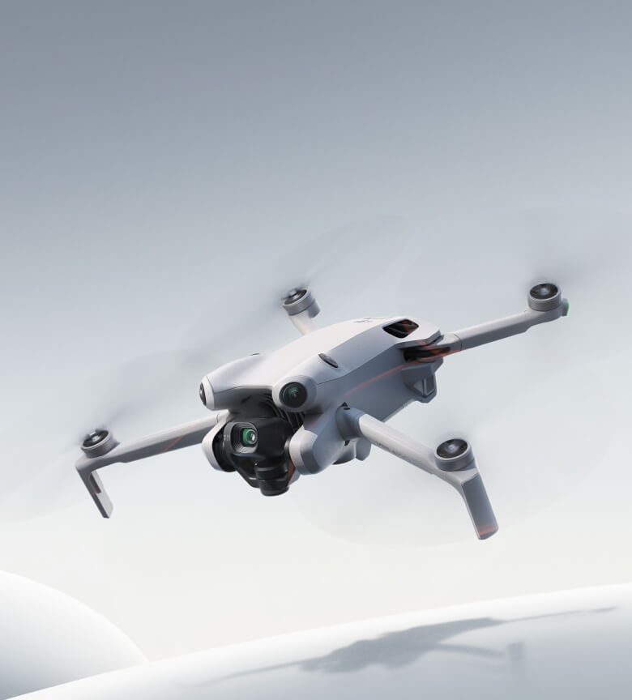
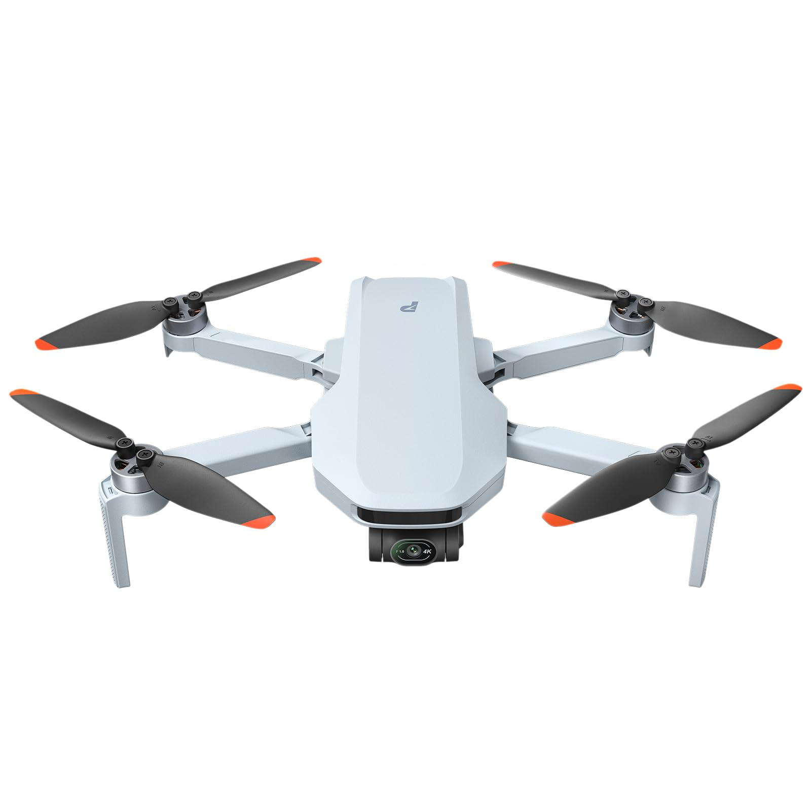
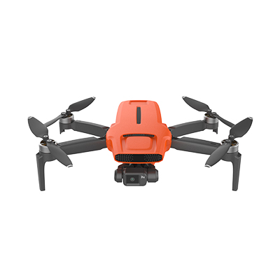
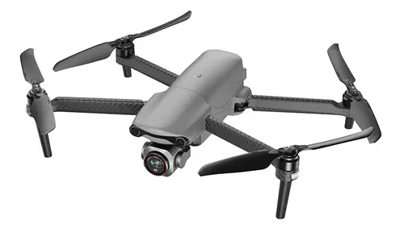
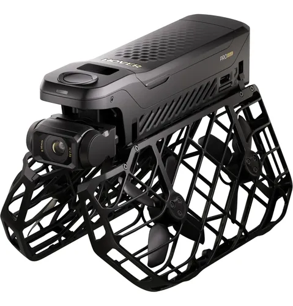

# UAS COMERCIALES

### Tipos, características y comparación costo–beneficio

---

## 1. ¿QUÉ ES UN UAS?

Un **UAS (Unmanned Aircraft System)** es un sistema de aeronave no tripulada junto con los equipos y sistemas necesarios para operarla. Por tanto, **UAS no significa únicamente “dron”**: comprende la aeronave, el sistema de control, las comunicaciones y los elementos necesarios para su operación.

### Componentes principales

| Componente | Función |
|---|---|
| **Aeronave no tripulada** | Estructura, motores, hélices, batería y sensores |
| **Sistema de control** | Control remoto, software y estación de control |
| **Comunicaciones** | Transmisión de órdenes, vídeo y datos |
| **Navegación** | GPS/GNSS, sensores y sistemas de posicionamiento |
| **Carga útil** | Cámara, sensores térmicos, LiDAR u otros equipos |

---

# 2. TIPOS DE UAS

| Tipo | Características principales | Usos habituales |
|---|---|---|
| **Multirrotor** | Varios rotores, despegue vertical y vuelo estacionario | Fotografía, vídeo, inspección |
| **Ala fija** | Mayor eficiencia aerodinámica y autonomía | Cartografía, vigilancia, grandes áreas |
| **VTOL híbrido** | Despegue vertical + vuelo de ala fija | Cartografía, vigilancia y cobertura |
| **Helicóptero UAS** | Rotor principal y gran capacidad de carga | Aplicaciones especializadas |
| **Nano / Micro UAS** | Muy pequeños y ligeros | Educación, interiores y recreación |

### Tipo de los modelos analizados

Los cinco modelos seleccionados son **UAS multirrotor comerciales**, aunque el HOVERAir X1 Pro tiene un enfoque especialmente orientado al vuelo autónomo y seguimiento del usuario.

---

# 3. MODELOS ANALIZADOS

| DJI | Potensic | FIMI |
|:---:|:---:|:---:|
|  |  |  |
| **Mini 4 Pro** | **ATOM 2** | **Mini 3** |
| **US$759** | **US$359.99** | **US$299** |
| 34 min | 32 min | 32 min |

| Autel Robotics | HOVERAir |
|:---:|:---:|
|  |  |
| **EVO Lite+** | **X1 Pro** |
| **US$1,149** | **US$499** |
| 40 min | 16 min |

---

# 4. COMPARACIÓN TÉCNICA

| Característica | **DJI Mini 4 Pro** | **Potensic ATOM 2** | **FIMI Mini 3** | **Autel EVO Lite+** | **HOVERAir X1 Pro** |
|---|---:|---:|---:|---:|---:|
| **Precio** | US$759 | US$359.99 | **US$299** | US$1,149 | US$499 |
| **Autonomía** | 34 min | 32 min | 32 min | **40 min** | 16 min |
| **Alcance** | **20 km** | 10 km | 9 km | 12 km | ~1 km* |
| **Velocidad máx.** | 57.6 km/h | 57.6 km/h | 64.8 km/h | **68 km/h** | ~60 km/h |
| **Peso** | <249 g | <249 g | <250 g | 835 g | 191.5 g |
| **Cámara** | 48 MP | 48 MP | 48 MP | 20 MP | 4K/60 |
| **Sensor** | 1/1.3" CMOS | 1/2" CMOS | 1/2" CMOS | **1" CMOS** | 1/2" CMOS |
| **Gimbal** | 3 ejes | 3 ejes | 3 ejes | 3 ejes | 2 ejes |
| **GPS/GNSS** | Sí | Sí | Sí | Sí | Sistema propio |

> **Nota:** alcance, velocidad y autonomía son valores máximos declarados por los fabricantes bajo condiciones de prueba. En condiciones reales pueden disminuir por viento, temperatura, carga, interferencias y configuración.

> \* En HOVERAir, el alcance aproximado corresponde al uso del Beacon y no es directamente comparable con los sistemas de transmisión de larga distancia de los otros modelos.

---

# 5. COMPARACIÓN POR CATEGORÍAS

### Precio

🥇 **FIMI Mini 3 — US$299**

🥈 **Potensic ATOM 2 — US$359.99**

🥉 **HOVERAir X1 Pro — US$499**

### Autonomía

🥇 **Autel EVO Lite+ — 40 min**

🥈 **DJI Mini 4 Pro — 34 min**

🥉 **Potensic ATOM 2 / FIMI Mini 3 — 32 min**

### Alcance

🥇 **DJI Mini 4 Pro — hasta 20 km**

🥈 **Autel EVO Lite+ — hasta 12 km**

🥉 **Potensic ATOM 2 — hasta 10 km**

### Velocidad

🥇 **Autel EVO Lite+ — 68 km/h**

🥈 **FIMI Mini 3 — 64.8 km/h**

🥉 **HOVERAir X1 Pro — ~60 km/h**

---

# 6. MARCO DE COSTO–BENEFICIO

| Criterio | Peso |
|---|---:|
| **Precio** | **25%** |
| **Autonomía** | **15%** |
| **Cámara / sensores** | **15%** |
| **Alcance** | **10%** |
| **Velocidad** | **10%** |
| **Seguridad** | **10%** |
| **Funciones** | **10%** |
| **Portabilidad** | **5%** |
| **TOTAL** | **100%** |

**Puntuación final = Σ (calificación × peso)**

El objetivo no es determinar simplemente cuál tiene las mejores especificaciones, sino **qué modelo entrega más prestaciones por el dinero invertido**.

---

# 7. RESULTADO

## 🥇 POTENSIC ATOM 2

### MEJOR COSTO–BENEFICIO GENERAL

**US$359.99 · 32 min · <249 g · 10 km · 48 MP**

El **Potensic ATOM 2** destaca por su equilibrio entre precio y prestaciones:

- Precio inferior al DJI Mini 4 Pro.
- 32 minutos de autonomía.
- Hasta 10 km de transmisión.
- Sensor CMOS de 1/2".
- Cámara de 48 MP.
- Menos de 249 g.
- Grabación de alta resolución.
- Funciones inteligentes y de seguimiento.

---

# 8. RANKING GENERAL

| Posición | Modelo | Evaluación |
|:---:|---|:---:|
| **1** | **Potensic ATOM 2** | ★★★★★ Mejor costo–beneficio |
| **2** | **FIMI Mini 3** | ★★★★★ Mejor precio |
| **3** | **DJI Mini 4 Pro** | ★★★★ Mejor equilibrio premium |
| **4** | **HOVERAir X1 Pro** | ★★★★ Mejor para seguimiento autónomo |
| **5** | **Autel EVO Lite+** | ★★★★ Mejor autonomía/cámara |

> El ranking representa el resultado de **esta metodología específica**. Cambiar los pesos puede cambiar el ganador.

---

# 9. ¿CUÁL ELEGIR SEGÚN LA NECESIDAD?

| Necesidad | Opción recomendada | Motivo |
|---|---|---|
| **Mejor costo–beneficio** | 🥇 **Potensic ATOM 2** | Gran equilibrio entre precio y prestaciones |
| **Precio más bajo** | **FIMI Mini 3** | US$299 |
| **Mejor paquete general** | **DJI Mini 4 Pro** | Seguridad, cámara, portabilidad y transmisión |
| **Mayor autonomía** | **Autel EVO Lite+** | Hasta 40 minutos |
| **Mayor sensor de cámara** | **Autel EVO Lite+** | Sensor CMOS de 1" |
| **Seguimiento autónomo** | **HOVERAir X1 Pro** | Diseñado alrededor del seguimiento y vuelo autónomo |

---

# 10. CONCLUSIÓN

**No existe un UAS que sea el mejor en todas las categorías.**

El **Autel EVO Lite+** ofrece la mayor autonomía y un sensor de cámara de mayor tamaño, pero su precio y peso son considerablemente superiores.

El **DJI Mini 4 Pro** ofrece uno de los paquetes más completos de la comparación, especialmente en seguridad, transmisión, cámara y portabilidad, aunque su precio es mayor que el de las alternativas económicas.

El **FIMI Mini 3** destaca por su precio de entrada, mientras que el **HOVERAir X1 Pro** utiliza un concepto diferente, centrado en el seguimiento autónomo.

### VEREDICTO

> **El Potensic ATOM 2 presenta el mejor costo–beneficio general dentro de los cinco modelos analizados**, porque combina un precio relativamente bajo con autonomía, portabilidad, cámara y alcance suficientes para competir con modelos considerablemente más costosos.

---

# FUENTES

- **DJI — Mini 4 Pro:** https://www.dji.com/mini-4-pro/specs
- **Potensic — ATOM 2:** https://www.potensic.com/atom-2.html
- **FIMI — Mini 3:** https://store.fimi.com/products/fimimini3-camera-drone
- **Autel Robotics — EVO Lite+:** https://shop.autelrobotics.com/products/drones-evo-lite-plus
- **HOVERAir — X1 Pro:** https://www.hoverair.com/products/hoverair-x1-pro
- **FAA — UAS:** https://www.faa.gov/faq/what-unmanned-aircraft-system-uas

### UAS COMERCIALES · 2026

**Análisis técnico · Comparación de marcas · Costo–beneficio**

